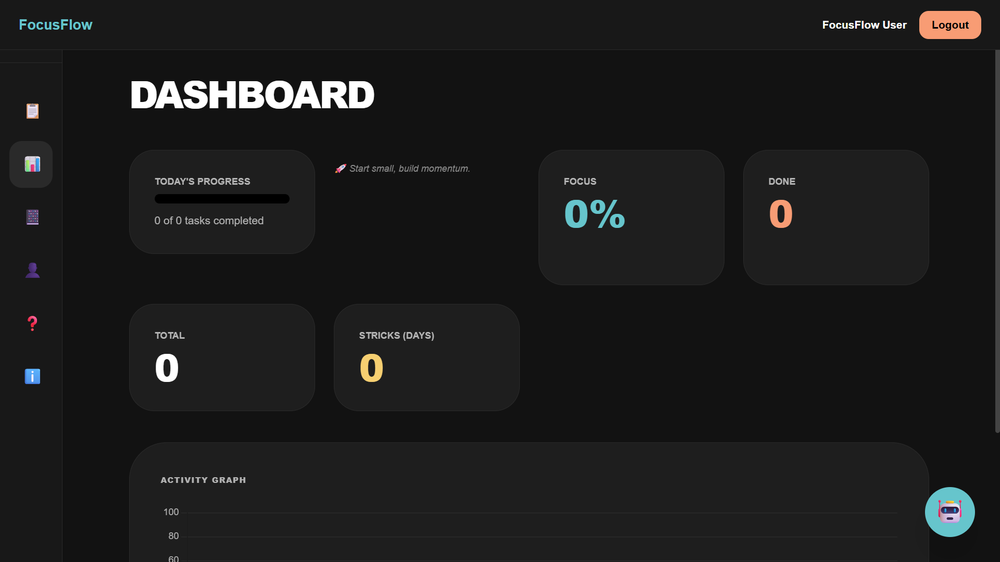
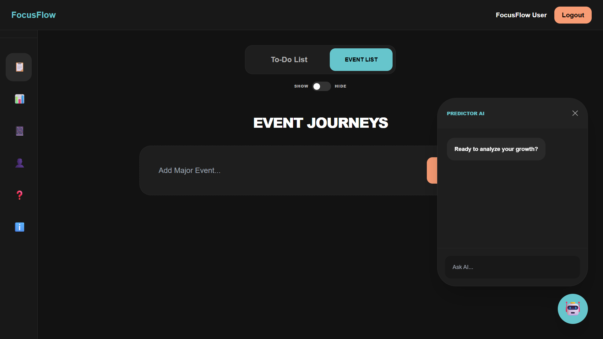
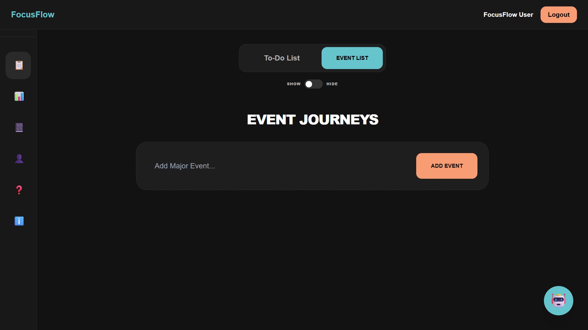
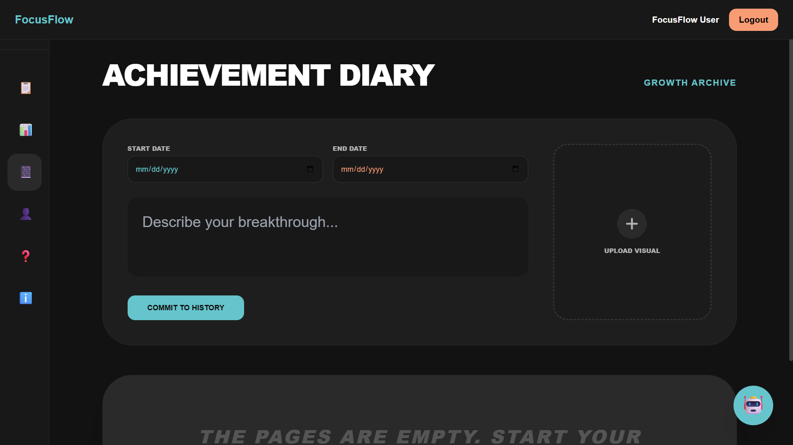
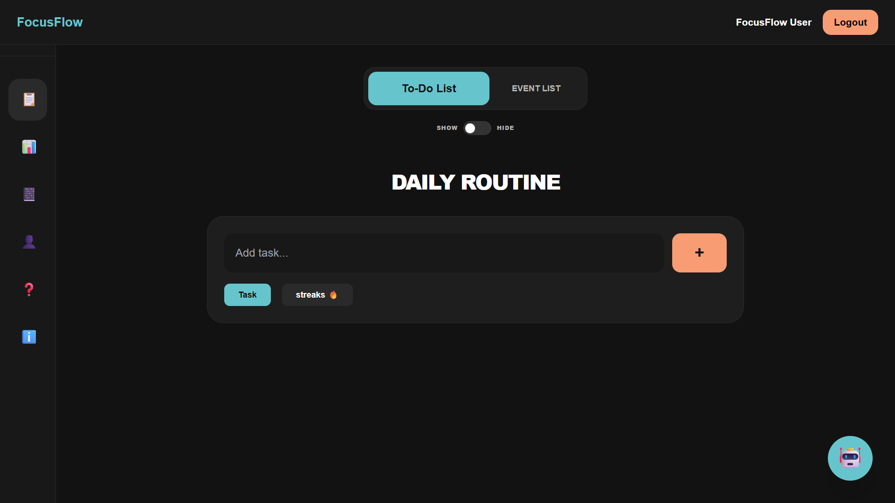
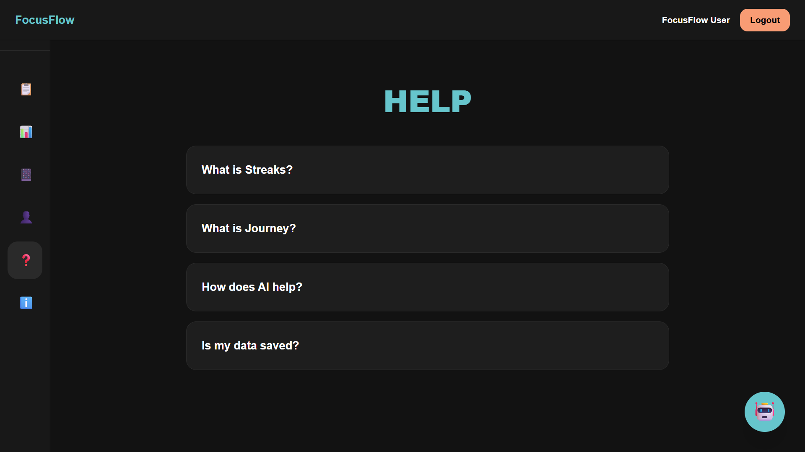
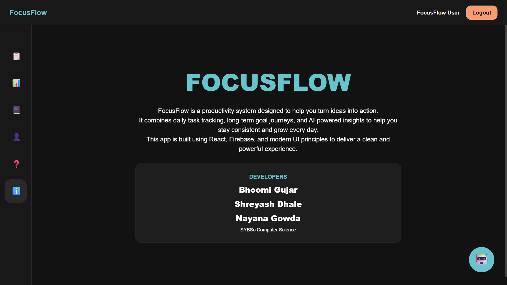
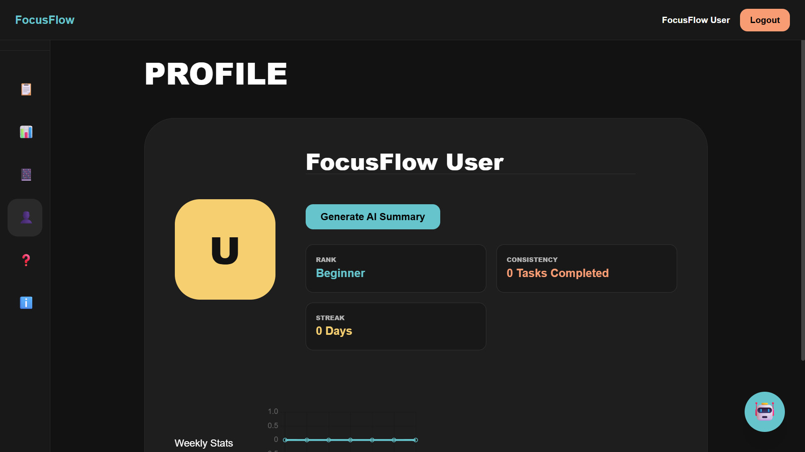

# 🚀 FocusFlow – AI-Powered Productivity App

FocusFlow is a smart productivity web application that helps users build consistency, track progress, and achieve goals using AI-powered tools.

---

## ✨ Features

* 🧠 **AI Learning Journeys**
  Generate structured step-by-step roadmaps for any skill.

* 🤖 **AI Chat Assistant (Predictor AI)**
  Ask questions and get intelligent responses instantly.

* 📊 **AI Summary Generator**
  Get motivational summaries based on your activity.

* 📅 **Daily Routine Manager**
  Plan and organize your day effectively.

* 📓 **Achievement Diary**
  Record your daily achievements and reflections.

* 🔥 **Streak System**
  Track consistency and maintain streaks.

* 👤 **Profile Section**
  View and manage user details.

* ❓ **Help & About Section**
  Learn how to use the app and understand features.

* 🔐 **Authentication System**
  Login using Email/Password and Google (Firebase Auth).

* 📝 **Task & Journey Management**
  Create and track goals with subtasks.

* 🔗 **Smart Learning Resources**
  Each step includes helpful learning links.

* ☁️ **Cloud Storage**
  Data stored and synced using Firebase Firestore.

---

## 🛠️ Tech Stack

* **Frontend:** React.js
* **Backend:** Vercel Serverless Functions
* **Database:** Firebase Firestore
* **Authentication:** Firebase Auth (Google + Email)
* **AI Integration:** OpenRouter API
* **Styling:** Tailwind CSS

---

## 🌐 Live Demo

👉 https://focus-flow-app-mauve.vercel.app/

---

## 📸 Screenshots

### 🏠 Dashboard



### 🤖 AI Assistant



### 🧠 Learning Journey



### 📓 Achievement Diary



* 📅 **Daily Routine Manager**



* ❓ **Help & About Section**




* 👤 **Profile Section**



---

## ⚙️ Installation & Setup

Follow these steps to run the project locally:

### 1️⃣ Clone the repository

```bash
git clone https://github.com/YOUR-USERNAME/focusflow.git
cd focusflow
```

### 2️⃣ Install dependencies

```bash
npm install
```

### 3️⃣ Setup environment variables

Create a `.env` file in the root folder and add:

```env
OPENROUTER_API_KEY=your_api_key_here
```

### 4️⃣ Run the project

```bash
npm start
```

### 5️⃣ Open in browser

http://localhost:3000

---

## 🔐 Environment Variables

| Variable           | Description             |
| ------------------ | ----------------------- |
| OPENROUTER_API_KEY | API key for AI features |

---

## 🚀 Deployment

Deployed using **Vercel** with automatic CI/CD.

---

## 🧠 How It Works

1. User logs in using Firebase Authentication
2. Adds goals or routines
3. AI generates structured learning steps
4. User tracks tasks, streaks, and achievements
5. AI provides chat support and summaries

---

## 📌 Future Improvements

* 📱 Mobile optimization
* 📊 Analytics dashboard
* 🌙 Dark mode

---

## 👨‍💻 Developers

* Bhoomi Gujar
* Shreyash Dhale
* Nayana Gowda

---

## ⭐ Support

If you like this project, give it a ⭐ on GitHub!
